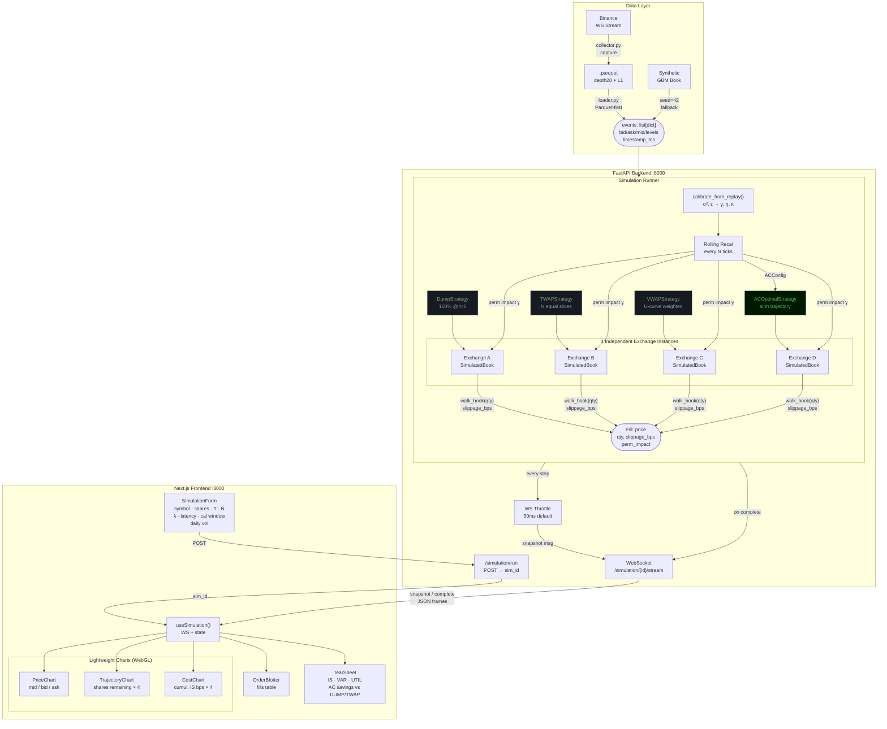

# TRACE-ZERO — Optimal Execution Simulator

> A full-stack institutional-grade trading simulator that replays real market microstructure data and compares four liquidation strategies — **Almgren-Chriss optimal execution**, VWAP, TWAP, and market dump — measuring implementation shortfall, execution variance, and AC utility across a live animated Bloomberg Terminal UI.

---

## What This Is

Most execution algorithm implementations are theoretical scripts that spit out a matplotlib graph. This one isn't.

TRACE-ZERO connects a **market replay engine** (real Binance L2 orderbook data) to a **simulated matching engine** that walks the full depth of book to compute exact multi-level slippage, applies permanent and temporary price impact as orders are filled, and models network execution latency. Four strategies run simultaneously against independent exchange instances. The result streams tick-by-tick over WebSocket to a Bloomberg Terminal-aesthetic UI built with TradingView's Lightweight Charts library.

The payoff: a live tear sheet that quantifies, in basis points, exactly how much the AC optimal trajectory saves over every industry benchmark — including VWAP, the actual standard desks use.

---

## The Finance

### Almgren-Chriss Optimal Liquidation (2000)

Given a position of $X$ shares to liquidate over horizon $T$ with $N$ child orders, the model solves for the trajectory $\{x_j\}$ minimising mean-variance execution cost:

$$\min_{\{x_j\}} \quad E[C] + \lambda \cdot \text{Var}[C]$$

Where:
- **Permanent impact** — each trade shifts the midprice permanently: $g(v) = \gamma \cdot v$
- **Temporary impact** — per-trade spread + depth cost: $h(v) = \varepsilon \cdot \text{sgn}(v) + \eta \cdot v/\tau$
- **$\lambda$** — risk aversion (controls the speed/risk tradeoff: $\lambda \to 0$ approaches TWAP, $\lambda \to \infty$ approaches immediate dump)

The closed-form optimal schedule uses a hyperbolic sine trajectory:

$$\tilde{x}_j = X \cdot \frac{2\sinh\!\left(\tfrac{1}{2}\kappa\tau\right)}{\sinh(\kappa T)} \cdot \cosh\!\left(\kappa\!\left(T - \left(j - \tfrac{1}{2}\right)\tau\right)\right)$$

Where $\kappa$ is derived from the model parameters and encodes the "urgency" of execution.

### Calibration from Real L2 Data

AC parameters are derived directly from the replay feed and updated dynamically:

| Parameter | How it's derived |
|-----------|-----------------|
| $\sigma^2$ | Rolling variance of log mid-price returns, scaled to interval $\tau = T/N$; recalibrated every `calibration_window` ticks |
| $\varepsilon$ | Rolling median half-spread: `median((ask - bid) / 2)` over the calibration window |
| $\gamma$, $\eta$ | Standard AC scaling from spread and daily volume estimate — exposed as UI overrides |
| $\kappa$ | Recomputed from updated $\sigma^2$ and $\varepsilon$ on each recalibration cycle (heteroscedasticity correction) |

### L2 Walk-the-Book Slippage

When L2 depth data is available, the matching engine replaces the analytical temporary impact formula with exact multi-level slippage:

$$\text{fill\_price}(q) = \frac{\sum_{\ell} p_\ell \cdot \min(q_\ell,\, q_{\text{remaining}})}{\sum_{\ell} \min(q_\ell,\, q_{\text{remaining}})}$$

Orders consume resting bid-side volume level-by-level. If the order size exceeds total resting depth, the remainder fills at the worst available price. This models real institutional execution far more accurately than the flat-book assumption.

### VWAP Strategy

The VWAP benchmark executes proportional to a stylized intraday volume profile:

$$w(t) = \text{base} + \text{amplitude} \cdot (2t - 1)^2, \quad t \in [0,1]$$

This U-shaped curve (high volume at open and close, lower mid-session) mirrors crypto market microstructure. Child order sizes are weighted by $w(t)$ normalized to sum to total shares — the actual methodology used by institutional execution desks.

### Implementation Shortfall

Each strategy's execution quality is measured in basis points:

$$\text{IS (bps)} = \frac{P_{\text{arrival}} - \text{VWAP}_{\text{fills}}}{P_{\text{arrival}}} \times 10{,}000$$

A lower shortfall = more value extracted from the liquidation.

---

## Architecture



---

## Project Structure

```
trace-zero/
├── backend/
│   ├── main.py                         # FastAPI app, CORS
│   ├── models/
│   │   └── almgren_chriss.py           # ACConfig + AlmgrenChriss + recalibrate()
│   ├── engine/
│   │   ├── order.py                    # Order / Fill dataclasses
│   │   ├── book.py                     # SimulatedBook: L2 depth + walk_book()
│   │   └── exchange.py                 # SimulatedExchange: walk-book fills + latency queue
│   ├── strategies/
│   │   ├── base.py                     # Abstract Strategy + TradeSlice
│   │   ├── dump.py                     # 100% at t=0
│   │   ├── twap.py                     # N equal slices over T
│   │   ├── vwap.py                     # U-shaped volume profile schedule
│   │   └── ac_optimal.py               # AC hyperbolic sine schedule
│   ├── simulation/
│   │   ├── config.py                   # SimulationConfig (incl. latency_ms, cal_window)
│   │   ├── runner.py                   # Orchestrator: rolling cal + throttle + latency
│   │   └── results.py                  # StrategyResult + SimulationResult (4 strategies)
│   ├── market_replay/
│   │   ├── collector.py                # Binance combined stream (bookTicker + depth20)
│   │   ├── normalizer.py               # L1 + L2 event normalization
│   │   ├── logger.py                   # Parquet (Polars/Snappy) + JSONL fallback writer
│   │   ├── replay.py                   # Generator-based replay
│   │   └── loader.py                   # Parquet-first loader + dual-format metadata
│   └── api/
│       ├── routes.py                   # REST endpoints
│       └── ws.py                       # WebSocket streaming
├── frontend/
│   └── src/
│       ├── app/
│       ├── components/
│       │   ├── Terminal.tsx            # Root grid layout
│       │   ├── TopBar.tsx              # Brand bar + live clock + status
│       │   ├── SimulationForm.tsx      # Parameters incl. Latency + Cal Window
│       │   ├── PriceChart.tsx          # Mid-price (Lightweight Charts)
│       │   ├── TrajectoryChart.tsx     # Shares remaining — 4 strategies
│       │   ├── CostChart.tsx           # Cumulative shortfall — 4 strategies
│       │   ├── TearSheet.tsx           # 4-column Bloomberg comparison table
│       │   ├── OrderBlotter.tsx        # Scrolling child order fills
│       │   └── Panel.tsx               # Reusable panel wrapper
│       └── hooks/
│           └── useSimulation.ts        # WS connection + React state (vwap added)
├── data/                               # Captured .parquet files (git-ignored)
├── scripts/
│   └── capture_data.py                 # CLI capture wrapper
├── pyproject.toml
└── OptimalPath(withoutMarketMovements).py   # Original reference (kept for diff)
```

---

## Getting Started

### Prerequisites

- Python ≥ 3.11
- Node.js ≥ 18

### 1. Install backend

```bash
git clone https://github.com/Dharshan2004/trace-zero.git
cd trace-zero
pip install -e .
```

Dependencies include `polars` and `pyarrow` for Parquet support — install them if not pulled automatically:

```bash
pip install polars pyarrow
```

### 2. Start the API server

```bash
uvicorn backend.main:app --reload --port 8000
```

No data file required — if `data/` is empty the runner generates a synthetic BTC price path (geometric random walk, ~$97k mid, 3-level synthetic L2 book) so you can run immediately.

### 3. Start the frontend

```bash
cd frontend
npm install
npm run dev
```

Open **`http://localhost:3000`**.

### 4. Run your first simulation

The form is pre-filled with sensible defaults. Hit **`GO`** and watch:

- **Price chart** — mid-price from the replay feed
- **Trajectory chart** — Dump drops to zero instantly (red), TWAP steps linearly (yellow), VWAP follows volume curve (purple), AC traces a concave curve (green)
- **Shortfall chart** — cumulative cost in bps diverges over time; AC should finish lowest
- **Tear sheet** — final VWAP price, IS shortfall, trajectory variance, and utility for all four strategies with best (green) / worst (red) highlighting

---

## Capturing Real Market Data

### L2 capture (recommended)

Subscribes to the Binance combined stream (`bookTicker` + `depth20@100ms`) and writes a Parquet file with full depth data:

```bash
# Via the API (background task)
curl -X POST http://localhost:8000/api/capture \
  -H "Content-Type: application/json" \
  -d '{"symbol": "BTCUSDT", "duration_seconds": 60, "use_l2": true}'

# Output: data/BTCUSDT_60s.parquet
```

### L1 legacy capture

```bash
python scripts/capture_data.py BTCUSDT 60
# Output: data/BTCUSDT_60s.jsonl (still supported)
```

Files land in `data/` (git-ignored). The UI lists available files automatically via `GET /api/symbols`. Parquet files take priority over JSONL when both exist for the same symbol.

### Using Real Data Effectively

IS ordering in the tear sheet is **market-condition dependent** when real data is loaded:

| Market condition during capture | DUMP IS | TWAP/VWAP/AC IS | Why |
|---|---|---|---|
| Price **falls** | Low (best) | High | DUMP sold at peak; later fills are cheaper |
| Price **rises** | High (worst) | Lower | DUMP sold at trough; TWAP/AC caught the rally |
| Price **flat** | High (worst) | Lower | Only market impact matters; single large dump pays more |

For a reliable demo with the expected ordering (DUMP worst, AC best), capture during a **low-volatility, flat-to-slightly-rising window** — typically early morning UTC or weekends. Avoid capturing during strong directional moves or news events.

**Verify a capture before presenting:**

```bash
python3 - << 'EOF'
import json

events = []
with open('data/BTCUSDT_60s.jsonl') as f:
    for line in f:
        if line.strip():
            events.append(json.loads(line))

first_mid = (events[0]['bid'] + events[0]['ask']) / 2
last_mid  = (events[-1]['bid'] + events[-1]['ask']) / 2
drift_bps = (last_mid - first_mid) / first_mid * 10000
depth     = sum(float(l[1]) for l in events[0].get('bid_levels', []))

print(f"Events : {len(events)}")
print(f"Drift  : {drift_bps:+.1f} bps  ({'FLAT ✓' if abs(drift_bps) < 5 else 'RISING ✓' if drift_bps > 0 else 'FALLING ✗ — recapture'})")
print(f"Depth  : {depth:.3f} BTC/side at tick 0")
EOF
```

**Green light**: drift between −5 bps and +15 bps. **Recapture** if drift < −5 bps (falling market means DUMP will show lowest IS).

**Recommended parameters with real data:**

| Parameter | Value | Why |
|---|---|---|
| `total_shares` | `1.0` | Real BTC book has ~1–2 BTC total depth per side; larger orders exhaust it and all strategies get identical worst-level fills |
| `liquidation_time` | `60` | Matches a 60s capture |
| `num_trades` | `20` | ~3s between child orders |
| `daily_volume_estimate` | `1000000000` | 1B USD default; increasing this shrinks γ and η, reducing impact differences |

**Guaranteed ordering (synthetic mode):** If you need deterministic DUMP-worst ordering regardless of market conditions, delete the data file — the simulator falls back to a seeded geometric random walk with a flat price path where only market impact matters.

```bash
rm data/BTCUSDT_60s.jsonl   # or .parquet
# Restart backend — simulator now runs in synthetic mode
```

---

## Simulation Parameters

| Parameter | Default | Description |
|-----------|---------|-------------|
| `symbol` | `BTCUSDT` | Market symbol label |
| `total_shares` | `1.0` | Total shares/contracts to liquidate |
| `liquidation_time` | `60` | Liquidation horizon in minutes |
| `num_trades` | `20` | Number of discrete child orders |
| `risk_aversion` | `1e-6` | AC lambda — higher = more front-loaded |
| `latency_ms` | `0` | Network round-trip latency in ms. Orders are evaluated against the book state `latency_ms` later — models execution risk |
| `calibration_window` | `100` | Rolling window size for volatility/spread recalibration. `0` = static (single-pass calibration) |
| `gamma_override` | `null` | Override calibrated permanent impact coefficient |
| `eta_override` | `null` | Override calibrated temporary impact coefficient |

---

## API Reference

| Method | Endpoint | Description |
|--------|----------|-------------|
| `GET` | `/api/symbols` | List available data files (.parquet + .jsonl) |
| `GET` | `/api/symbols/{symbol}/info` | Event count, time range, price range, format |
| `POST` | `/api/simulation/run` | Start simulation, returns `{"sim_id": "..."}` |
| `WS` | `/api/simulation/{sim_id}/stream` | Stream throttled snapshots |
| `POST` | `/api/capture` | Trigger live Binance L2 capture |

### POST /api/simulation/run

```json
{
  "symbol": "BTCUSDT",
  "total_shares": 1.0,
  "liquidation_time": 60,
  "num_trades": 20,
  "risk_aversion": 1e-6,
  "latency_ms": 30.0,
  "calibration_window": 100,
  "ui_throttle_ms": 50,
  "gamma_override": null,
  "eta_override": null
}
```

### WebSocket snapshot message

```json
{
  "type": "snapshot",
  "step": 5,
  "total_steps": 20,
  "mid_price": 97432.10,
  "timestamp_ms": 1709654400000,
  "strategies": {
    "dump": { "shares_remaining": 0.0,  "avg_price": 97380.0, "cumulative_cost_bps": 52.1 },
    "twap": { "shares_remaining": 0.75, "avg_price": 97445.0, "cumulative_cost_bps": 18.3 },
    "vwap": { "shares_remaining": 0.71, "avg_price": 97447.0, "cumulative_cost_bps": 14.6 },
    "ac":   { "shares_remaining": 0.82, "avg_price": 97448.0, "cumulative_cost_bps": 8.7  }
  }
}
```

Final message type is `"complete"` with the full `SimulationResult`.

---

## Verification Checklist

| Scenario | Expected behaviour |
|----------|--------------------|
| λ → 0 | AC schedule converges to TWAP (flat trade list) |
| λ → ∞ | AC schedule converges to Dump (one large first trade) |
| All shares sold | Each strategy liquidates 100% by final step |
| Trajectory shapes | Dump: vertical drop at t=0. TWAP: linear staircase. VWAP: U-weighted staircase. AC: smooth concave curve |
| Shortfall ordering | For moderate λ: IS(dump) > IS(twap) > IS(vwap) > IS(ac) |
| Latency effect | With `latency_ms=30`, fills execute against a book 30ms stale — IS should increase modestly |
| L2 vs L1 | With depth data, large orders should show higher IS than L1 (flat-book) mode due to level-walking |
| Permanent impact isolation | Changing λ should not affect Dump or TWAP results |
| Rolling calibration | With volatile data, kappa should drift across steps as sigma2 updates |

---

## Tech Stack

**Backend**
- **FastAPI** + **uvicorn** — async REST and WebSocket server
- **NumPy** — all AC model mathematics
- **Polars** + **PyArrow** — columnar Parquet I/O (~80% smaller than JSONL)
- **websockets** — Binance live L2 data capture
- Pure Python dataclasses throughout — no database, no ORM

**Frontend**
- **Next.js 15** (App Router, SWC compiler)
- **Lightweight Charts** (TradingView) — WebGL-accelerated financial charts
- **Tailwind CSS** — utility styling with custom Bloomberg color theme
- **JetBrains Mono** — monospace terminal font

---

## Reference

- Almgren, R. & Chriss, N. (2000). *Optimal execution of portfolio transactions.* Journal of Risk, 3(2), 5–39.
- Almgren, R. (2003). *Optimal execution with nonlinear impact functions and trading-enhanced risk.* Applied Mathematical Finance, 10(1), 1–18.

---

## Built For

<a href="https://projecthub.ntuscds.com/">
  
</a>

This project was built as part of the **[ProjectHub Mentorship Program 25/26](https://projecthub.ntuscds.com/)** — a project-based initiative by the **NTU School of Computer Science and Data Science (CCDS) Student Society** that connects students with mentors in computing and data science to build real-world projects and gain industry exposure.

> _Hands-on, project-focused mentorship · Small mentor–mentee groups · Technical growth and career exploration_

---

## Team

| | Name | GitHub | Role |
|---|------|--------|------|
|  | Kannan Priyadharshan | [@Dharshan2004](https://github.com/Dharshan2004) | Lead Engineer |
|  | Arya Vatsa | [@AryaVatsa](https://github.com/AryaVatsa) | Engineer |
|  | Poh Shi Sien | [@PohShiSien](https://github.com/PohShiSien) | Engineer |

---

## License

MIT — see [LICENSE](LICENSE)
